<div align="center">

# Beautiful Graph

### See the structure in your knowledge.

A cinematic graph view for Obsidian, designed around folder-driven and Karpathy-style knowledge bases.

[](https://github.com/DawsonBodenhamer/beautiful-graph/releases)
[](https://obsidian.md/)
[](LICENSE)

**Folder-aware indexes · Directory Groups · Curated palettes · Living ambience**

</div>


Beautiful Graph keeps graph navigation familiar and concentrates on what the native view does not provide: folder semantics, readable `index.md` hubs, visual Groups, expressive palettes, Folder Lens contours, and a deeply adjustable atmosphere.

## Help keep it beautiful

<table>
  <tr>
    <td align="center">
      <h3>Pretty graphs do not buy groceries. Yet.</h3>
      <p>If Beautiful Graph earns a permanent tab in your vault, a star helps people find it, thoughtful feedback helps make it better, and a few dollars can help fund the next round of polish—and possibly next week's groceries.</p>
      <p>
        <a href="https://github.com/DawsonBodenhamer/beautiful-graph"></a>
        <a href="https://github.com/DawsonBodenhamer/beautiful-graph/issues/new"></a>
      </p>
      <p><em>A direct support link will be added before the public release.</em></p>
    </td>
  </tr>
</table>

## Built for Karpathy-style knowledge bases

[Andrej Karpathy's LLM Wiki pattern](https://gist.github.com/karpathy/442a6bf555914893e9891c11519de94f) uses an LLM-maintained Markdown wiki between raw sources and the person exploring them. `index.md` files become important navigation hubs as the wiki grows.

That structure is exactly what Beautiful Graph is designed to reveal.

- An `index.md` node is labeled from its directory hierarchy instead of appearing as another indistinguishable **index**.
- Repeated indexes remain readable across nested knowledge areas.
- Top-level directories can become color-coded Groups automatically.
- **Beautiful Default** reserves stable semantic colors and icons for `dev`, `outputs`, `raw`, and `wiki`.
- The vault root, Group indexes, ordinary notes, and uncategorized notes each retain a distinct visual role.

The result is a graph where the shape of the wiki is visible—not merely the links between files.

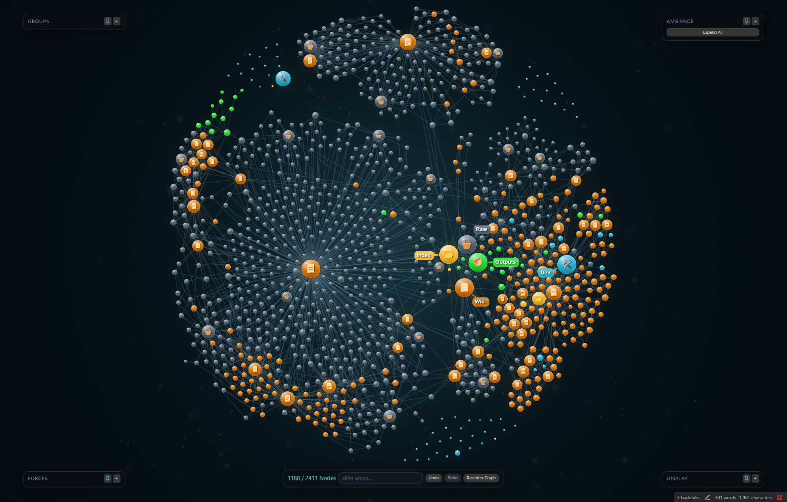

<div align="center"><sub>Shown on a 2,411-note vault with folder hubs and semantic Groups.</sub></div>

## What Beautiful Graph adds

| Feature | What it changes |
|---|---|
| **Folder-aware index labels** | Turns repeated `index.md` files into recognizable directory and hierarchy labels. |
| **Directory Groups** | Colors, icons, visibility, automatic analysis, per-row reset, and reusable presets for folder families. |
| **Folder Lens** | Draws soft contours around the notes belonging to a selected directory. |
| **Curated palettes** | Recolors the complete Group system without rebuilding it by hand. |
| **Index presentation** | Gives root and Group indexes distinct scale, glow, icon, label, and linked-family treatment. |
| **Ambience** | Adds a controllable vignette, color treatment, and two-layer depth-aware dust field. |
| **On-canvas studio controls** | Keeps Groups, Forces, Display, and Ambience available as movable, pinnable panels with presets and undo/redo. |

## See whole folders at once

Select a Group name and Folder Lens traces every connected region belonging to that directory—even when the graph has arranged those notes into separate islands.

<table>
  <tr>
    <td width="50%" align="center">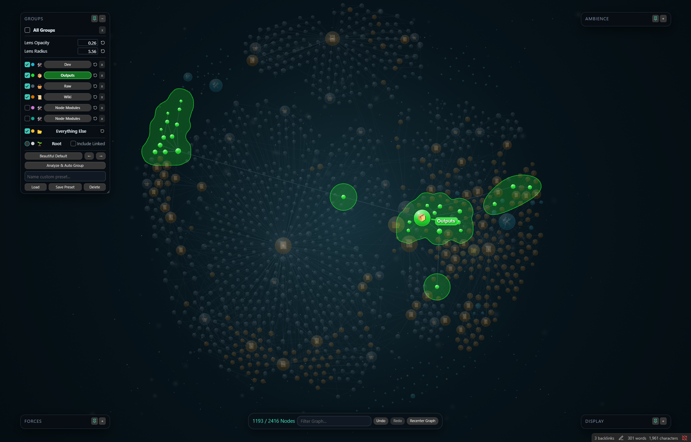<br><sub>Outputs</sub></td>
    <td width="50%" align="center">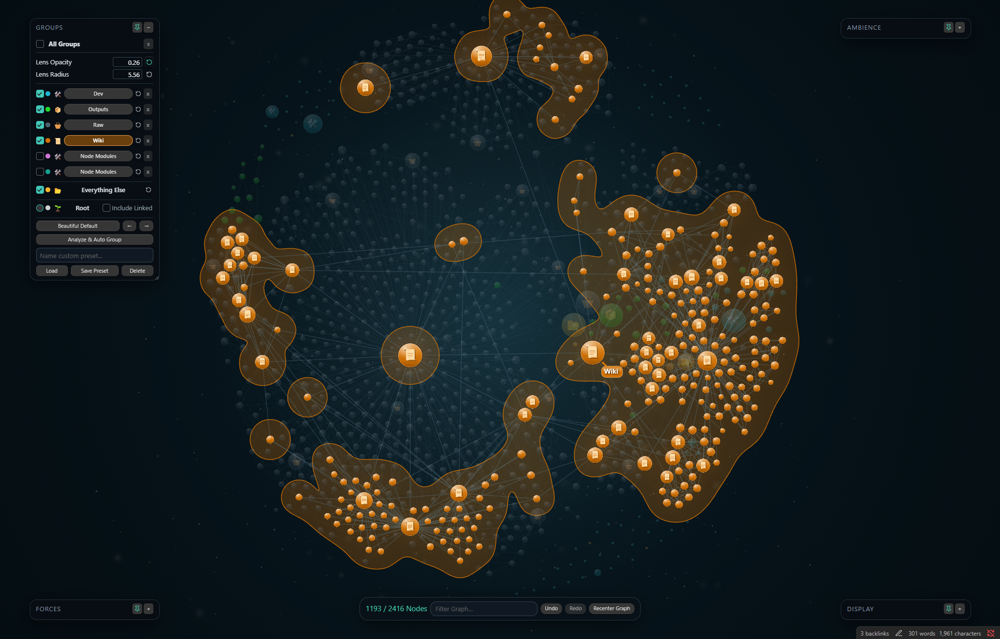<br><sub>Wiki</sub></td>
  </tr>
</table>

## Hover into a neighborhood

Hover a node to bring its immediate family forward while the rest of the vault falls softly out of focus. Large index hubs and compact directory families remain readable without losing their place in the whole graph.

<table>
  <tr>
    <td width="50%" align="center">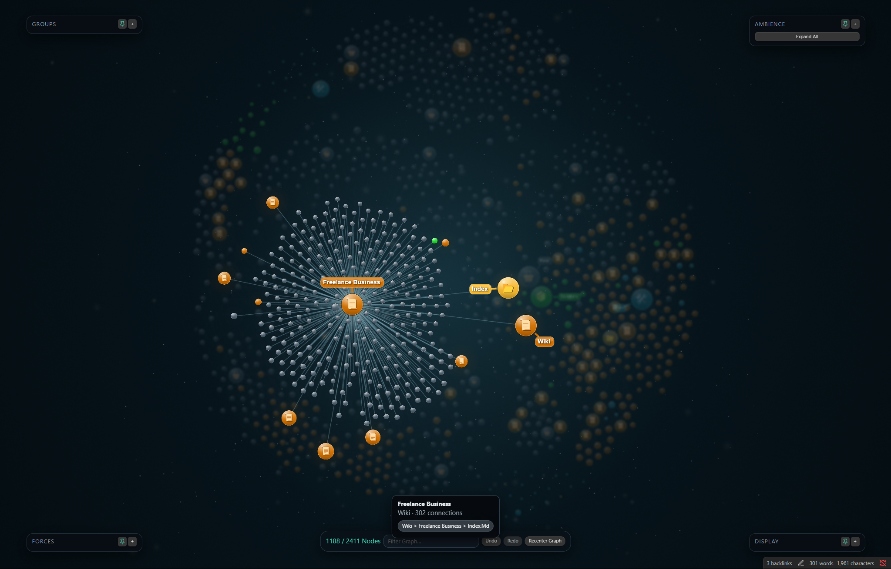<br><sub>A large index family</sub></td>
    <td width="50%" align="center">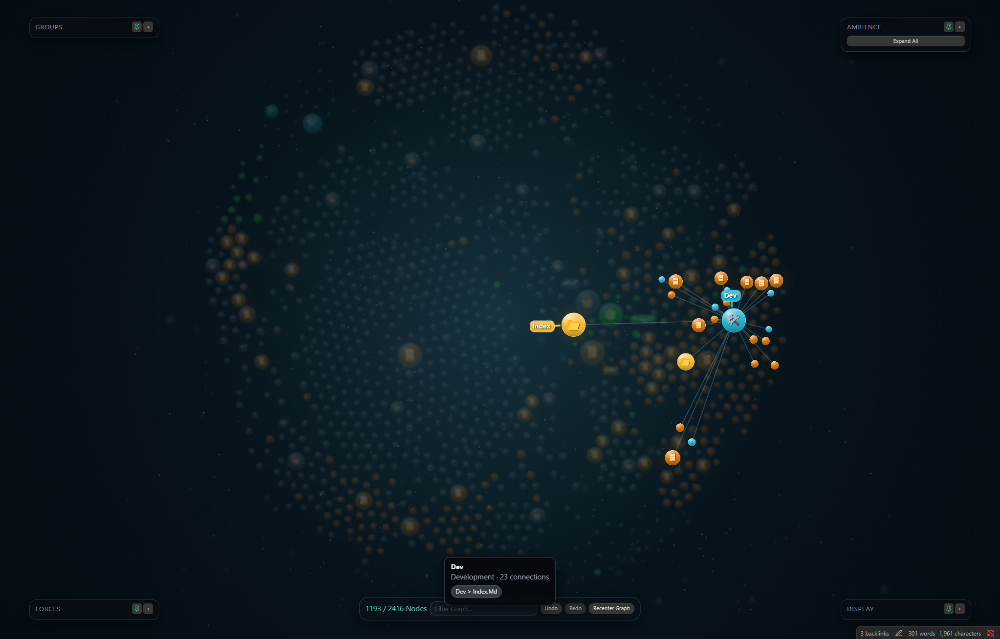<br><sub>A compact directory family</sub></td>
  </tr>
</table>

## Make the vault yours

Beautiful Graph includes six coordinated palettes. Colors remain editable after applying a palette, and any Group can be reset to its assigned palette color independently.

<table>
  <tr>
    <td width="50%" align="center">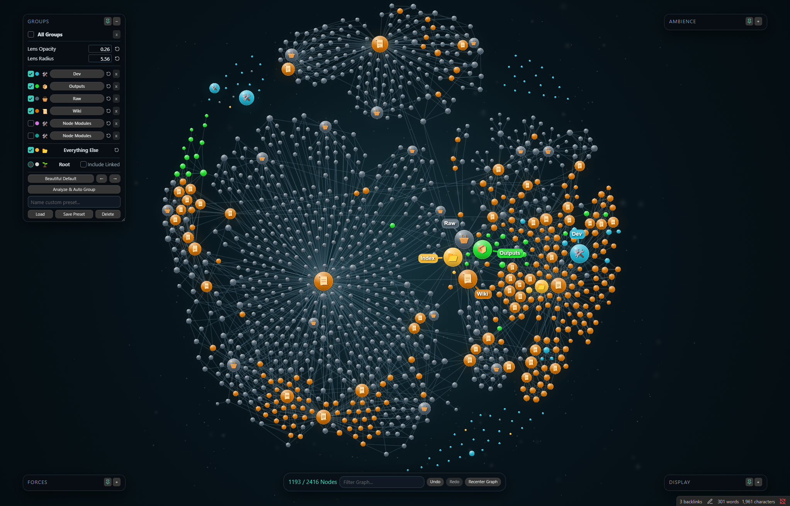<br><sub>Beautiful Default</sub></td>
    <td width="50%" align="center">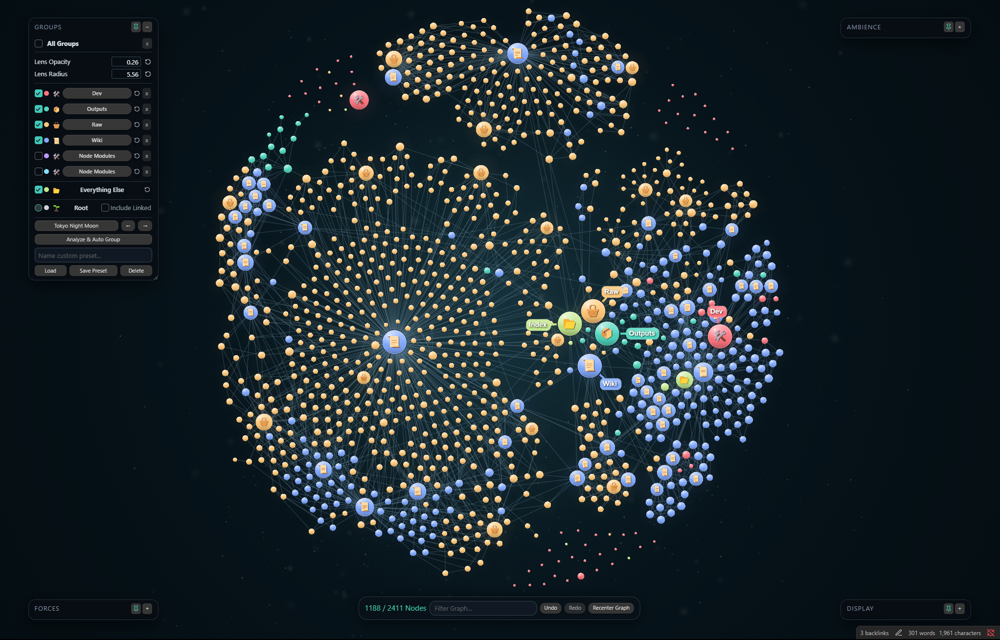<br><sub>Tokyo Night Moon</sub></td>
  </tr>
  <tr>
    <td width="50%" align="center"><br><sub>Nord Aurora</sub></td>
    <td width="50%" align="center">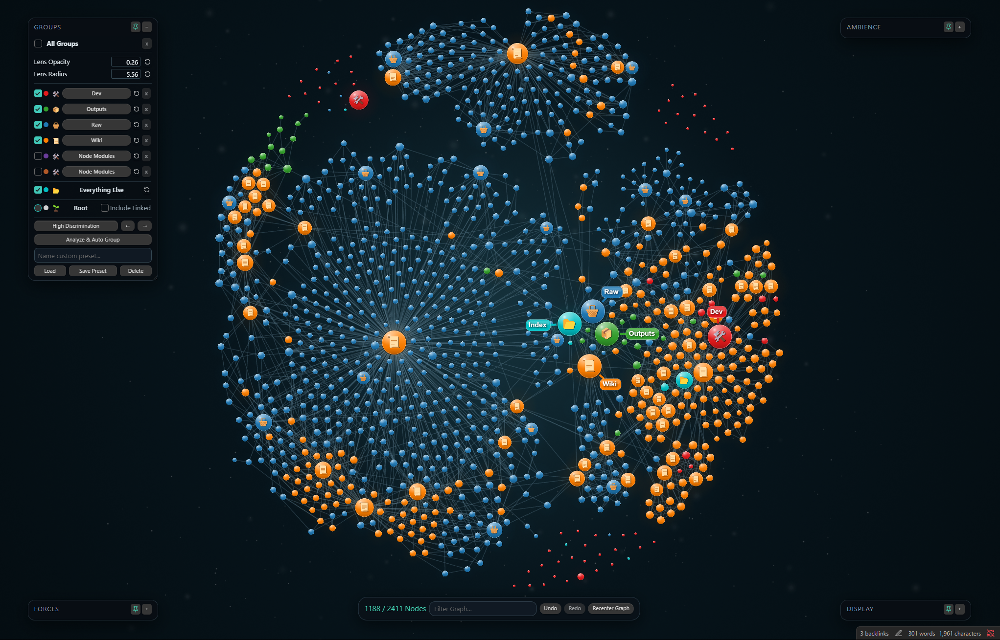<br><sub>High Discrimination</sub></td>
  </tr>
  <tr>
    <td width="50%" align="center">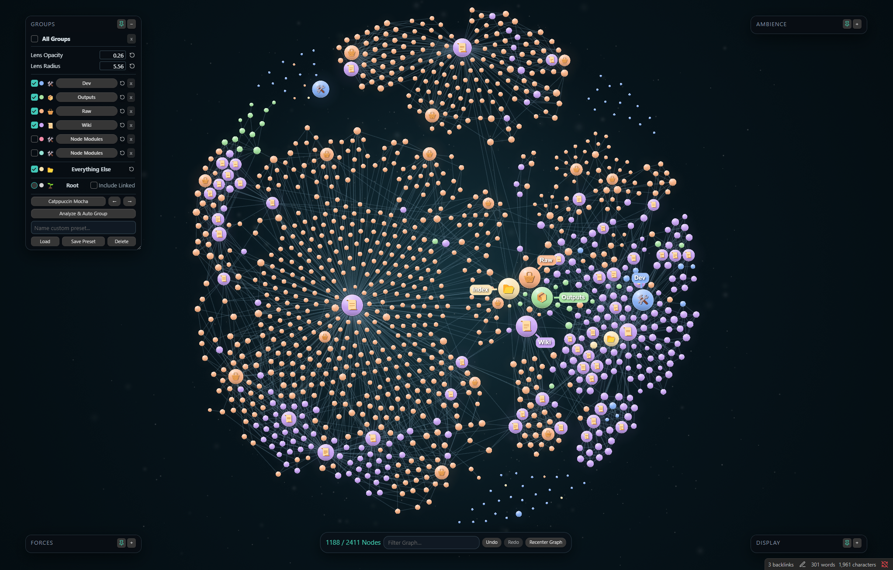<br><sub>Catppuccin Mocha</sub></td>
    <td width="50%" align="center">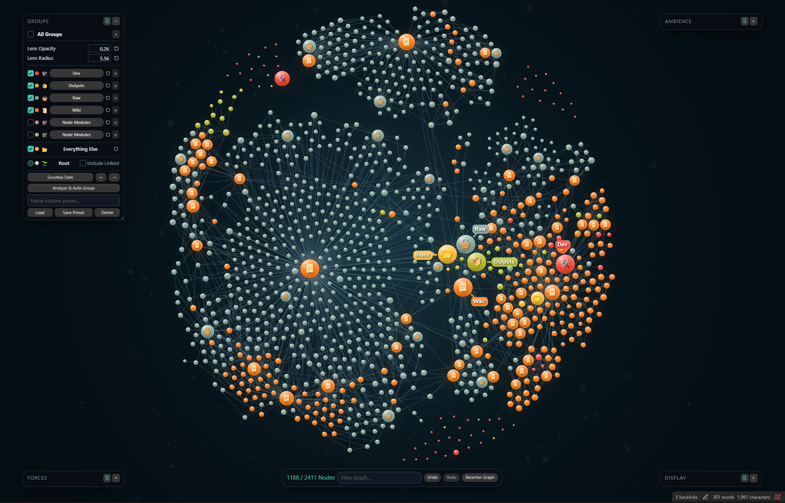<br><sub>Gruvbox Dark</sub></td>
  </tr>
</table>

## Tune it without leaving the graph

Every Beautiful Graph-specific visual system is controlled directly on the canvas:

- **Groups:** visibility, colors, icons, Folder Lens, palette selection, automatic analysis, and presets.
- **Ambience:** vignette, brightness, hue, saturation, particle speed, count, irregularity, size, fade, and boost.
- **Display:** label threshold, node and link scale, glow, sibling links, orphans, and focused-family centering.
- **Forces:** a compact four-control panel for shaping the layout when you want a different visual composition.

Panels can be pinned, collapsed, moved, resized, reset, and saved as presets. The bottom toolbar provides filter, undo, redo, and recenter controls without opening a settings page.

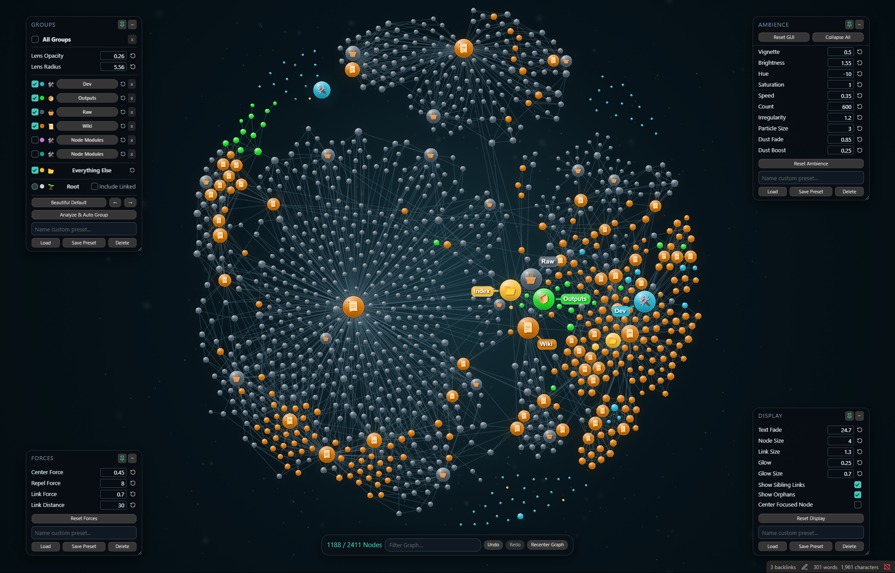

## Install

### Community plugins

1. Open **Settings → Community plugins → Browse**.
2. Search for **Beautiful Graph**.
3. Select **Install**, then **Enable**.

### BRAT

To install a beta build before it reaches Community plugins:

1. Install and enable [BRAT](https://github.com/TfTHacker/obsidian42-brat).
2. Choose **Add Beta plugin**.
3. Enter `DawsonBodenhamer/beautiful-graph`.

### Manual installation

Download `main.js`, `manifest.json`, and `styles.css` from the matching [GitHub release](https://github.com/DawsonBodenhamer/beautiful-graph/releases), then place them in:

```text
<your-vault>/.obsidian/plugins/beautiful-graph/
```

Restart Obsidian and enable **Beautiful Graph** under **Settings → Community plugins**.

> Beautiful Graph is desktop-only and requires Obsidian 1.5.0 or newer.

## Start with your folder structure

1. Open the command palette and run **Beautiful Graph: Open graph**, or select the orbit icon in the ribbon.
2. Expand **Groups** and select **Analyze & Auto Group** to discover the vault's top-level directories.
3. Choose a palette or assign individual colors and icons.
4. Select a Group name to toggle its Folder Lens.
5. Adjust Ambience and Display until the graph fits the vault's visual identity.
6. Save the result as presets if you want to experiment without losing it.

Beautiful Graph never edits note contents. Its settings, optional cooled position seeds, and local troubleshooting log stay in the plugin's Obsidian data directory.

<details>
<summary><strong>Build from source</strong></summary>

Requires Node.js 22+, npm, Rust `1.88.0`, and the `wasm32-unknown-unknown` target.

```powershell
npm ci
npm test
npm run build
cargo test --locked --workspace
```

The production build creates the three files used by Obsidian Community plugins: `main.js`, `manifest.json`, and `styles.css`.

</details>

## Contributing

Found a defect or have an idea? Open a [GitHub issue](https://github.com/DawsonBodenhamer/beautiful-graph/issues) with your Obsidian version, Beautiful Graph version, operating system, and reproduction steps.

Focused pull requests are welcome. Run the test and build commands before submitting changes. Generated runtime artifacts should not be committed.

## Current limitations

- Desktop only.
- A minimap is not currently included.
- File Explorer selection integration may need maintenance after major Obsidian interface changes.
- Very large vaults remain dependent on device capability and active visual settings.

---

<div align="center">

Built for wandering through ideas without losing the shape of them.

[Releases](https://github.com/DawsonBodenhamer/beautiful-graph/releases) · [Issues](https://github.com/DawsonBodenhamer/beautiful-graph/issues) · [MIT License](LICENSE)

</div>
